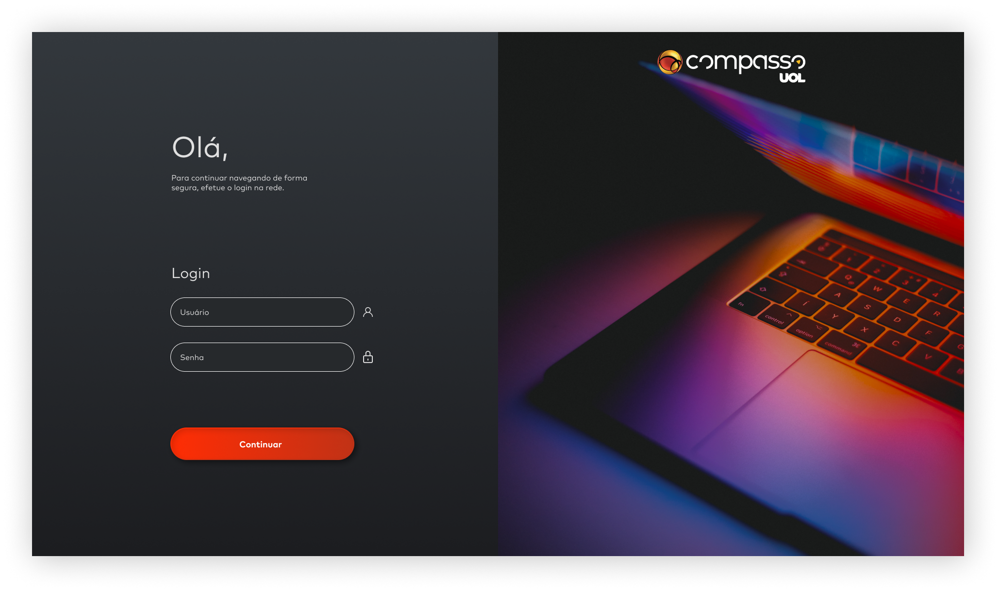
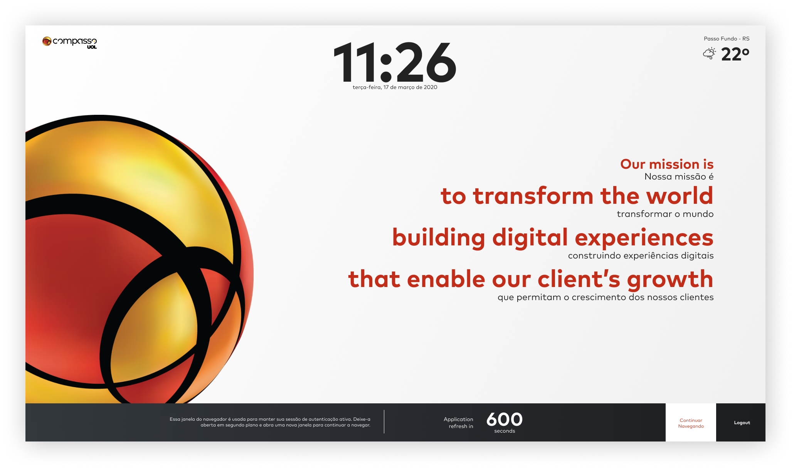

# Compass.uol-front-challenge-keep-alive
Sprint 4 - 4th Front-End challenge for the Compass.uol scholarship program

The Project corresponds to a login page that allows the user to access the home page by correctly entering the input data. The design to be followed was built through the following link: https://www.figma.com/file/D9NUCsGJ1gCvmL0ZUnb7SJ/keepalive?node-id=0%3A1

👀 project content:

* Full time and date logic on the Home screen;
* Login Logic with Username and Password;
* Weather Logic with reference to the geolocation of the logged in user;
* Logged Timer Logic in seconds (600s) which, when reset, should redirect to the Login page;
* Logout logic when clicking "Logout" on Home screen;
* Local Storage: save and remove username and password data;
* By clicking on "continuar navegando" opens the UOL news page;

🔑 mandatory requirements: 

* HTML, CSS e JavaScript;
* All functionality responding correctly.
 
:point_down: Login page image:

:point_down: Home page image:

